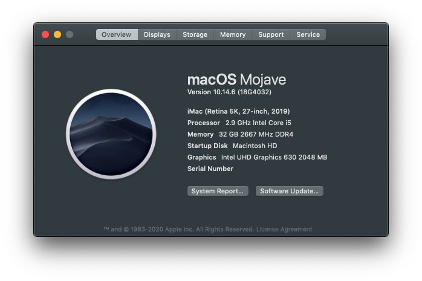

# DeskMini Hackintosh

### 系统信息

+ 操作系统版本: macOS Catalina 10.15.6 19G2021 x86_64 / (SMBIOS: iMac19,1)
+ OC版本: 0.6
+ CPU: Intel i5-9400 (6c6t) @ 2.90GHz
+ GPU: Intel UHD Graphics 630
+ 无线网卡: BCM94360CS2
+ SSD: 512GB [TOSHIBA RC500 NVMe](https://union-click.jd.com/jdc?e=&p=AyIGZRprFQMTBlQeUxMEGwFdKx9KWkxYZUIeUENQDEsFA1BWThgJBABAHUBZCQUdRUFGGRJDD1MdQlUQQwVKDFRXFk8jQA4SBlQaWhAKFAFcHVMlVHdgM2koUgd3UTdBP3ZiZHoLGg0TYh4LZRprFQMTB1MeXxwGEjdlG1wlVHwHVBpaFAMTBVYSaxQyEgNcHlsdARYAURxYFzIVB1wrWxwBFQRWHV8VBhFpFCtrJQEiN2UbaxYyUGkHTAkdUBYHARhfRlIXUlBMC0AKRg9cE1oVVhUEB0kLQTIQBlQfUg%3D%3D)
+ RAM: 8GB x 2 [ADATA DDR4 2400](https://union-click.jd.com/jdc?e=&p=AyIGZRteEgYSAVEcWRQyEARSGV0RAxAFVR5rUV1KWQorAlBHU0VeBUVNR0ZbSkdETlcNVQtHRVNSUVNLXANBRA1XB14DS10cQQVYD21XHgVWHFkTBhMFVxteJUZOXRUcBEFXcl8NXxNSHBsHMEIPUnIeC2UaaxUDEwdTHl8cBhI3ZRtcJUN8B1QaWBEEEwFlGmsVBhUOVBhYFQoRAF0SaxICGzdVElgSAREBURtfFmxTN2UrWCUyIgdlGGtXbEdXBh5fQgEaAlJLDBAEFQ9cGAlFBkEPVUsMFQFCAldLaxcDEwNc)
+ 显示器: [DELL U2518D](https://union-click.jd.com/jdc?e=&p=AyIGZRtaHAAaAFUdWh0yEQZdHVoTAhsCVRhrUV1KWQorAlBHU0VeBUVNR0ZbSkdETlcNVQtHRVNSUVNLXANBRA1XB14DS10cQQVYD21XHgRUE10UBBIOUBtYJV1KRgVPGRwHcEQraAlXQE9%2FIWs9ZmIeC2UaaxUDEwdTHl8cBhI3ZRtcJUN8AVYfWhIFIgZlG18TABIPVRpTEAsQBWUcWxwyEg5WHFgWBBYHURg1VDIiN1YrayUCIgRlWTVHVxQDB0lTHAMUDlYeUhECG1IGGAkcARZTVR1dHQcSAmUZWhQGGw%3D%3D)

### TELEGRAM
[Join Telegram](https://t.me/asrock_deskmini)

### 无线网卡

型号是BCM94360CS2，需要配合NGFF板子。SSD使用的是RC500，主要是单面颗粒，可以不需要延长线，虽然翘起来一点，但是不影响使用。

### BIOS设置

+ Load UEFI Defaults
+ Advanced > Chipset Configuration > Onboard HD Audio & Onboard HDMI HD Audio: Enabled
+ Advanced > Chipset Configuration > VT-d: Disabled
+ Advanced > USB Configuration     > XHCI Hand-off: Enabled
+ Advanced > CPU Configuration     > C States Support: Disabled
+ Advanced > Security              > Secure Boot: Disabled
+ Super IO Configuration -> Serial Port: Disabled
+ BOOT > CSM: Enabled

### ~~HMDI问题(Catalina) WhateverGreen Fix black screen on igfx since 10.15.5~~

### 请我吃个冰棒

[PayPal](https://www.paypal.me/iore)

### FCPX

### CREDITS

+ [xjn819 blog](https://blog.xjn819.com/?p=7)
