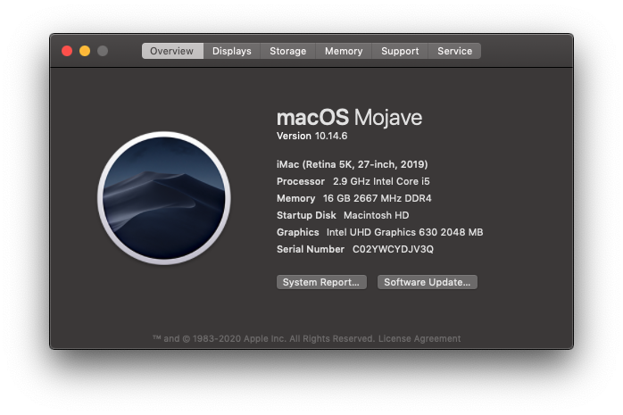
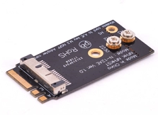

# DeskMini Hackintosh



### SPECS

+ OS: macOS Mojave 10.14.6 18G3020 x86_64 / (SMBIOS: iMac19,1)
+ CPU: Intel i5-9400 (6) @ 2.90GHz
+ GPU: Intel UHD Graphics 630
+ Wi-Fi: BCM94360CS2
+ SSD: 512GB [TOSHIBA RC500 NVMe](https://union-click.jd.com/jdc?e=&p=AyIGZRprFQMTBlQeUxMEGwFdKx9KWkxYZUIeUENQDEsFA1BWThgJBABAHUBZCQUdRUFGGRJDD1MdQlUQQwVKDFRXFk8jQA4SBlQaWhAKFAFcHVMlVHdgM2koUgd3UTdBP3ZiZHoLGg0TYh4LZRprFQMTB1MeXxwGEjdlG1wlVHwHVBpaFAMTBVYSaxQyEgNcHlsdARYAURxYFzIVB1wrWxwBFQRWHV8VBhFpFCtrJQEiN2UbaxYyUGkHTAkdUBYHARhfRlIXUlBMC0AKRg9cE1oVVhUEB0kLQTIQBlQfUg%3D%3D)
+ RAM: 8GB x 2 [ADATA DDR4 2400](https://union-click.jd.com/jdc?e=&p=AyIGZRteEgYSAVEcWRQyEARSGV0RAxAFVR5rUV1KWQorAlBHU0VeBUVNR0ZbSkdETlcNVQtHRVNSUVNLXANBRA1XB14DS10cQQVYD21XHgVWHFkTBhMFVxteJUZOXRUcBEFXcl8NXxNSHBsHMEIPUnIeC2UaaxUDEwdTHl8cBhI3ZRtcJUN8B1QaWBEEEwFlGmsVBhUOVBhYFQoRAF0SaxICGzdVElgSAREBURtfFmxTN2UrWCUyIgdlGGtXbEdXBh5fQgEaAlJLDBAEFQ9cGAlFBkEPVUsMFQFCAldLaxcDEwNc)
+ Monitor: [DELL U2518D](https://union-click.jd.com/jdc?e=&p=AyIGZRtaHAAaAFUdWh0yEQZdHVoTAhsCVRhrUV1KWQorAlBHU0VeBUVNR0ZbSkdETlcNVQtHRVNSUVNLXANBRA1XB14DS10cQQVYD21XHgRUE10UBBIOUBtYJV1KRgVPGRwHcEQraAlXQE9%2FIWs9ZmIeC2UaaxUDEwdTHl8cBhI3ZRtcJUN8AVYfWhIFIgZlG18TABIPVRpTEAsQBWUcWxwyEg5WHFgWBBYHURg1VDIiN1YrayUCIgRlWTVHVxQDB0lTHAMUDlYeUhECG1IGGAkcARZTVR1dHQcSAmUZWhQGGw%3D%3D)

### Wi-Fi Card

My Wi-Fi card is BCM94360CS2, you need to by a NGFF card like this one. TOSHIBA RC500 NVMe SSD don't have any nand in the back, so it's very nice to have.



### BOOTLOADER
+ OpenCore 0.5.6

### BIOS

+ Load UEFI Defaults
+ Advanced -> Chipset Configuration
  + Onboard HD Audio -> Enabled
  + Onboard HDMI HD Audio -> Enabled

+ Super IO Configuration
  + Serial Port -> Disabled

### HOW TO INSTALL

  + Create bootable USB(https://support.apple.com/en-us/HT201372)
    ```
    sudo /Applications/Install\ macOS\ Mojave.app/Contents/Resources/createinstallmedia --volume /Volumes/MyVolume
    ```

  + Mount EFI partition and PUT EFI folder to it

### TELEGRAM
[Join Telegram](https://t.me/asrock_deskmini)

### CHANGELOGS

+ macOS Mojave 10.14.6 18G3020 x86_64 🎉

### CREDITS

+ [xjn819 blog](https://blog.xjn819.com/?p=7)
